#### 方法一：数学

**思路**

记   为翻转后的数字，为完成翻转，我们可以重复「弹出」*x* 的末尾数字，将其「推入」  的末尾，直至 *x* 为 *0*。

要在没有辅助栈或数组的帮助下「弹出」和「推入」数字，我们可以使用如下数学方法：

```cpp
// 弹出 x 的末尾数字 digit
digit = x % 10
x /= 10

// 将数字 digit 推入 rev 末尾
rev = rev * 10 + digit
```

题目需要判断反转后的数字是否超过 *32* 位有符号整数的范围 *[-2^{31},2^{31}-1]*，例如 *x=2123456789* 反转后的  ，超过了 *32* 位有符号整数的范围。

因此我们需要在「推入」数字之前，判断是否满足 

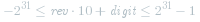 

若该不等式不成立则返回 *0*。

但是题目要求不允许使用 *64* 位整数，即运算过程中的数字必须在 *32* 位有符号整数的范围内，因此我们不能直接按照上述式子计算，需要另寻他路。

考虑 *x>0* 的情况，记 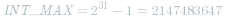 ，由于

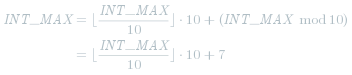 

则不等式

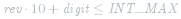 

等价于

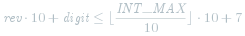 

移项得

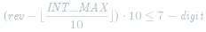 

讨论该不等式成立的条件：

若  ，由于 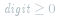 ，不等式不成立。
若  ，当且仅当 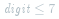  时，不等式成立。
若  ，由于 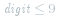 ，不等式成立。

注意到当   时若还能推入数字，则说明 *x* 的位数与 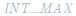  的位数相同，且要推入的数字 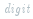  为 *x* 的最高位。由于 *x* 不超过  ，因此   不会超过   的最高位，即 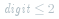 。所以实际上当   时不等式必定成立。

因此判定条件可简化为：**当且仅当   时，不等式成立**。

*x<0* 的情况类似，留给读者自证，此处不再赘述。

综上所述，判断不等式

 

是否成立，可改为判断不等式

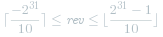 

是否成立，若不成立则返回 *0*。

**代码**

```C++ [sol1-C++]
class Solution {
public:
    int reverse(int x) {
        int rev = 0;
        while (x != 0) {
            if (rev < INT_MIN / 10 || rev > INT_MAX / 10) {
                return 0;
            }
            int digit = x % 10;
            x /= 10;
            rev = rev * 10 + digit;
        }
        return rev;
    }
};
```

```Java [sol1-Java]
class Solution {
    public int reverse(int x) {
        int rev = 0;
        while (x != 0) {
            if (rev < Integer.MIN_VALUE / 10 || rev > Integer.MAX_VALUE / 10) {
                return 0;
            }
            int digit = x % 10;
            x /= 10;
            rev = rev * 10 + digit;
        }
        return rev;
    }
}
```

```C# [sol1-C#]
public class Solution {
    public int Reverse(int x) {
        int rev = 0;
        while (x != 0) {
            if (rev < int.MinValue / 10 || rev > int.MaxValue / 10) {
                return 0;
            }
            int digit = x % 10;
            x /= 10;
            rev = rev * 10 + digit;
        }
        return rev;
    }
}
```

```go [sol1-Golang]
func reverse(x int) (rev int) {
    for x != 0 {
        if rev < math.MinInt32/10 || rev > math.MaxInt32/10 {
            return 0
        }
        digit := x % 10
        x /= 10
        rev = rev*10 + digit
    }
    return
}
```

```Python [sol1-Python3]
class Solution:
    def reverse(self, x: int) -> int:
        INT_MIN, INT_MAX = -2**31, 2**31 - 1

        rev = 0
        while x != 0:
            # INT_MIN 也是一个负数，不能写成 rev < INT_MIN // 10
            if rev < INT_MIN // 10 + 1 or rev > INT_MAX // 10:
                return 0
            digit = x % 10
            # Python3 的取模运算在 x 为负数时也会返回 [0, 9) 以内的结果，因此这里需要进行特殊判断
            if x < 0 and digit > 0:
                digit -= 10

            # 同理，Python3 的整数除法在 x 为负数时会向下（更小的负数）取整，因此不能写成 x //= 10
            x = (x - digit) // 10
            rev = rev * 10 + digit
        
        return rev
```

```C [sol1-C]
int reverse(int x) {
    int rev = 0;
    while (x != 0) {
        if (rev < INT_MIN / 10 || rev > INT_MAX / 10) {
            return 0;
        }
        int digit = x % 10;
        x /= 10;
        rev = rev * 10 + digit;
    }
    return rev;
}
```

```JavaScript [sol1-JavaScript]
var reverse = function(x) {
    let rev = 0;
    while (x !== 0) {
        const digit = x % 10;
        x = ~~(x / 10);
        rev = rev * 10 + digit;
        if (rev < Math.pow(-2, 31) || rev > Math.pow(2, 31) - 1) {
            return 0;
        }
    }
    return rev;
};
```

**复杂度分析**

- 时间复杂度： 。翻转的次数即 *x* 十进制的位数。

- 空间复杂度：*O(1)*。